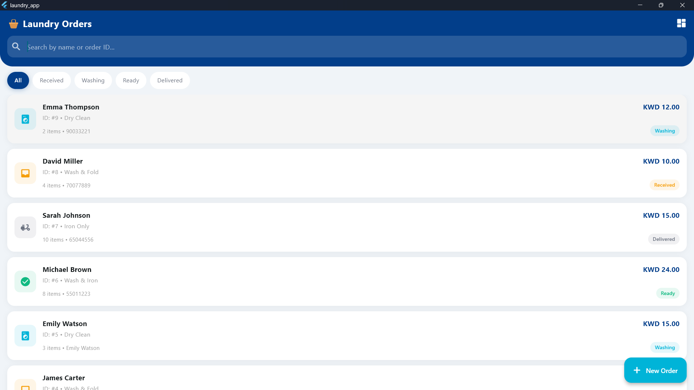
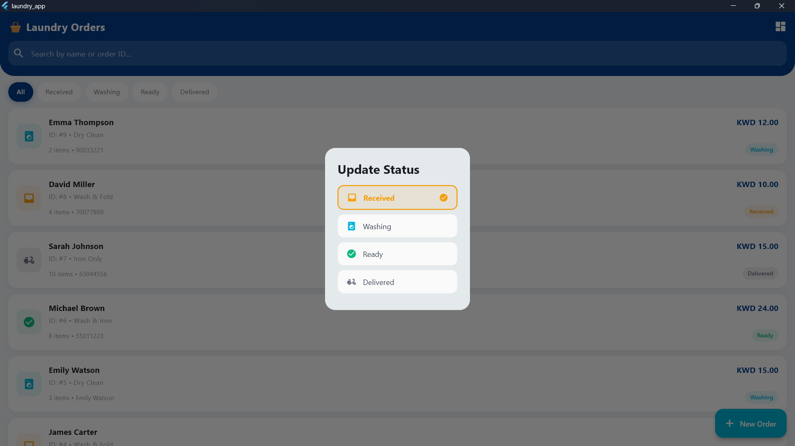
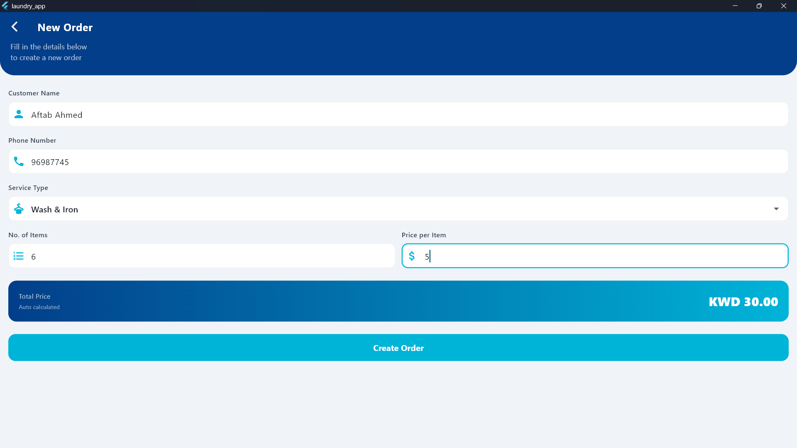
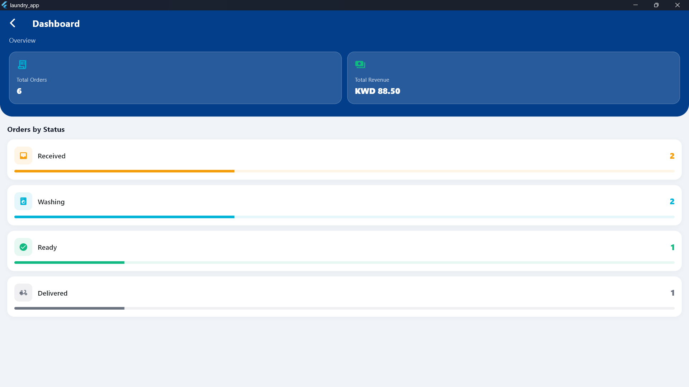
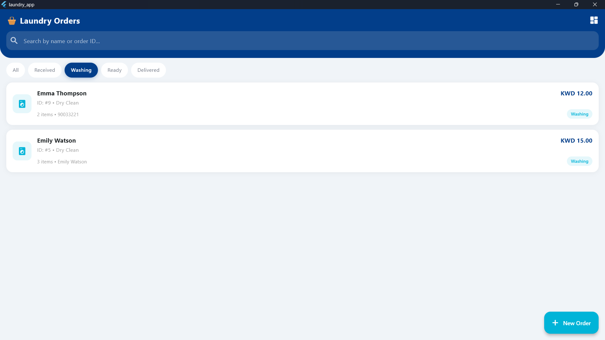
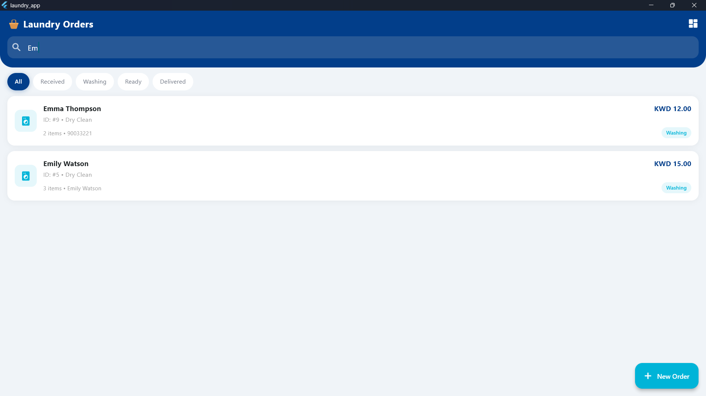
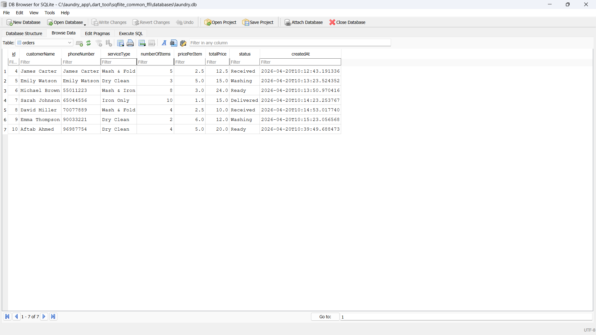
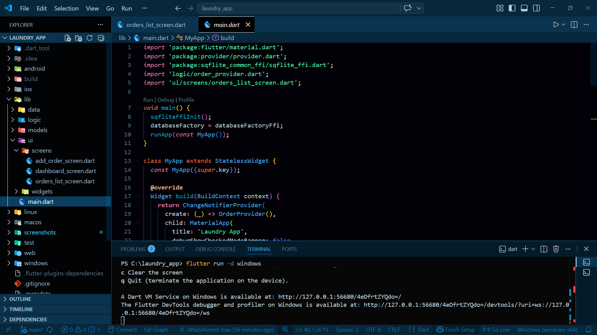

# Laundry Order Management App

A Flutter application to manage laundry service orders built with Provider state management and SQLite local database.

## Features
- View all laundry orders in a list
- Add new orders with auto-calculated total price
- Update order status: Received → Washing → Ready → Delivered
- Search orders by Customer Name or Order ID
- Filter orders by status
- Dashboard showing total orders and total revenue
- Delete orders with long press
- Form validation on all inputs

## Tech Stack
- **Framework:** Flutter & Dart
- **State Management:** Provider
- **Database:** SQLite via sqflite + sqflite_common_ffi
- **Platform:** Windows Desktop / Android

## Project Structure
```
lib/
├── models/
│   └── order.dart
├── data/
│   └── database_helper.dart
├── logic/
│   └── order_provider.dart
└── ui/
    └── screens/
        ├── orders_list_screen.dart
        ├── add_order_screen.dart
        └── dashboard_screen.dart
```

## How to Run

### Prerequisites
- Flutter SDK 3.x
- Windows: Visual Studio Build Tools 2022 with C++ workload
- Android: Android SDK + emulator or physical device

### Steps
```bash
git clone https://github.com/AftabAhmed-max/laundry-app.git
cd laundry-app
flutter pub get
flutter run -d windows   # for Windows
flutter run              # for Android
```

## Database Structure

**Table: orders**

| Column | Type | Description |
|---|---|---|
| id | INTEGER (PK) | Auto-incremented order ID |
| customerName | TEXT | Customer full name |
| phoneNumber | TEXT | Customer phone number |
| serviceType | TEXT | Type of laundry service |
| numberOfItems | INTEGER | Number of items |
| pricePerItem | REAL | Price per item |
| totalPrice | REAL | numberOfItems × pricePerItem |
| status | TEXT | Received / Washing / Ready / Delivered |
| createdAt | TEXT | Order creation timestamp |

## Screenshots

### Orders List


### Status Update Dialog


### Add New Order


### Dashboard


### Filter by Status


### Search Functionality


### Database (DB Browser SQLite)


### Project Structure & Code


## Demo Video
https://github.com/AftabAhmed-max/laundry-app/raw/main/screenshots/laundry_app_demo.mp4

## Download & Run

### Windows
1. Download `laundry_app_windows.zip` from [Releases](https://github.com/AftabAhmed-max/laundry-app/releases/tag/v1.0.0)
2. Extract the zip
3. Run `laundry_app.exe`

### Android
1. Download `laundry_app_android.apk` from [Releases](https://github.com/AftabAhmed-max/laundry-app/releases/tag/v1.0.0)
2. Enable "Install from unknown sources" in phone settings
3. Install and open the app